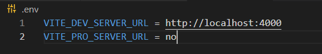
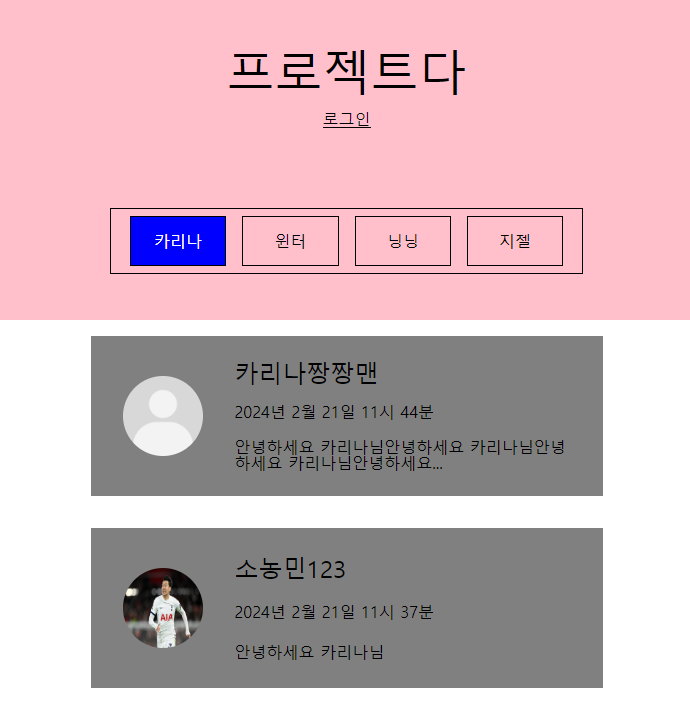
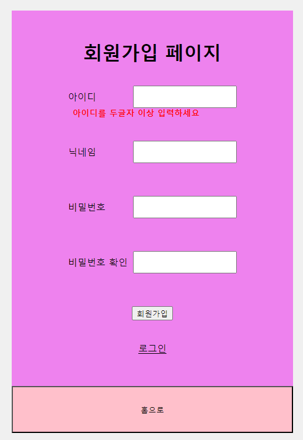
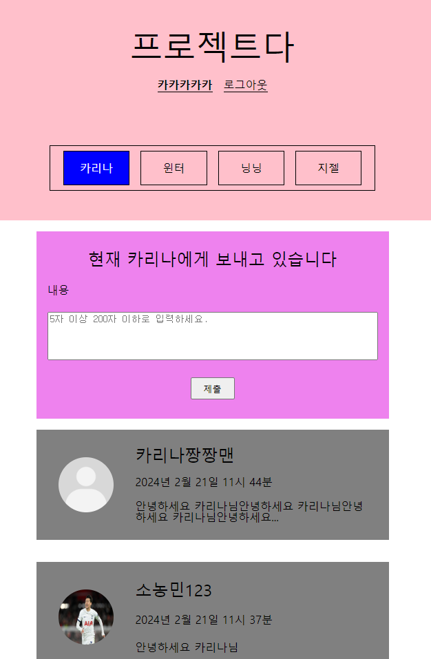

# 내배캠 리액트 세번째 개인 프로젝트

### 🔽 **프로젝트 소개**

**프로젝트명** : 팬레터 사이트 기능 추가하기

**개발 기간** : 2024.02.20 ~ 2024.02.21(2일간)

**프로젝트 소개** : 내배캠 두번째 리액트 프로젝트에 로그인 기능을 추가하여 완성도 높히기

**원본 깃허브 링크** : https://github.com/picoloman6/nbc_react_2_fan_letter

<br>

### 🔽 **개발 환경**

- **Frontend :** React, TypeScript, axios, redux, react-router-dom, react-cookie, uuid, stitches
- **Database :** json-server
- **Etc :** cross-env, vite

<br>

### **🔽 시작 가이드**

**1. 환경변수 설정**



**2. json-server 시작**

```bash
yarn install
yarn server
```

**3. Vite 서버 시작**

```bash
yarn dev
```

<br>

### 🔽 추가 기능

#### 1. 로그인 적용 후 메인화면

- 로그인 버튼 추가
- 로그아웃 시 편지 입력란 숨김
- 편지에 사용자 사진 추가



#### 2. 로그인화면

- custom hook을 활용하여 입력값 유효성 검사 구현
- jwt authentication API를 활용하여 로그인 및 회원가입 구현


#### 3. 회원가입화면

- 로그인과 동일



#### 4. 로그인 후 메인화면

- 로그인 이후 입력란 사용 가능
- 개인정보 페이지 이동 버튼 및 로그아웃 버튼 사용 가능



#### 5. 마이페이지

- 사용자 닉네임 및 사진 변경


#### 6. 편지 수정 및 삭제

- 본인 작성글에서만 가능


<br>

### 🔽 KTP 회고

#### Keep (유지하고 싶은 좋았던 점)

- 기존 프로젝트에 새로운 기능을 추가하는 경험
- react-cookie를 활용한 api 인가 구현
- axios의 인스턴스를 활용한 체계적인 api 로직 구현
- 두 번의 custom hook 사용

#### Problem (아쉬웠던 점)

- 비즈니스 로직과 뷰 로직을 완벽하게 분리하지 못한 것
- 컴포넌트 분리 단위가 페이지마다 다른 것

#### Try (Problem 해결 방법, 앞으로의 다짐 등)

- 컴포넌트 디자인 패틴 공부하기
